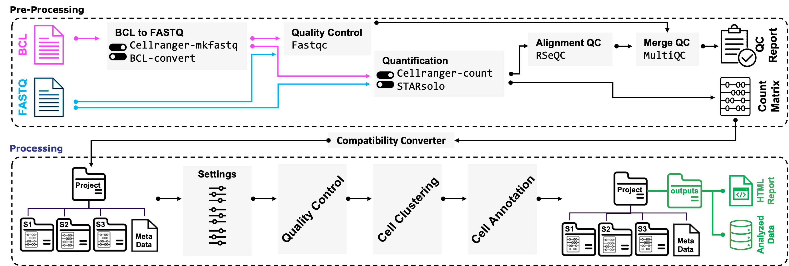

[](http://www.repostatus.org/#active)
[](https://www.tidyverse.org/lifecycle/#stable)

<p align="center" width="100%">
 
</p>

# CellBridge

**CellBridge** is an automated and versatile workflow meticulously designed to
simplify and expedite the standard procedures entailed in scRNA-seq analysis,
eliminating the need for specialized bioinformatics expertise. CellBridge
harnesses cutting-edge computational methods, integrating an array of advanced
functionalities. It encompasses various crucial steps in scRNA-seq analysis,
starting from the initial conversion of raw unaligned sequencing reads into the
FASTQ format, followed by read alignment, gene expression quantification,
quality control, doublet removal, normalization, batch correction,
dimensionality reduction, clustering, identification of cell markers, and
accurate cell type annotation. CellBridge provides convenient parameterization
of the workflow, while its Docker-based framework ensures reproducibility of
results across diverse computing environments. 

See [CellBridge](https://github.com/Sanofi-Public/PMCB-CellBridge) for the main
processing steps of the data.

<p align="center" width="100%">
 
</p>

---

## Workflow Inputs

<details>

The pipeline inputs (and for that matter, outputs) are all contained in single folder, hereafter named ```workdir``` (but can be named whatever you'd like).
How to name the <run_id> folders is up to you. We recommend using something recognizable like the flow cell number. Each BCL folder should contain a ```SampleSheet.csv```

```
data
├── input_bcl
│   ├── <run_id>
│   └── <run_id>
├── input_fastq
│   ├── <run_id>
│   └── <run_id>
├── cr_count_reference
├── star_solo_reference
├── cr_count_reference_template
│   ├── genome.fa
│   └── genes.gtf
├── star_solo_reference_template
│   ├── genome.fa
│   └── genes.gtf
├── library_files 
└── feature_ref.csv
```

### I have BCLs form two sequencing runs and I want to get count matrices using Cellranger count.

Place the reference genome in the ```cr_count_reference``` folder, and your BCLs into the appropriate folders:

```
data
├── input_bcl
│   ├── <run_id>
│   └── <run_id>
└── cr_count_reference
```

### I have FASTQs from two sequencing runs and I want to get count matrices using STARsolo.

Place the reference genome in the ```star_solo_reference``` folder, and your BCLs into the appropriate folders:

```
data
├── input_fastq
│   ├── <run_id>
│   │    ├── S1_S1_L001_R1_001.fastq.gz
│   │    ├── S1_S1_L001_R2_001.fastq.gz
│   │    ├── S2_S2_L001_R1_001.fastq.gz
│   │    └── S2_S2_L001_R2_001.fastq.gz
│   └── <run_id>
│        ├── S1_S1_L001_R1_001.fastq.gz
│        ├── S1_S1_L001_R2_001.fastq.gz
│        ├── S2_S2_L001_R1_001.fastq.gz
│        └── S2_S2_L001_R2_001.fastq.gz
└── star_solo_reference
```

### I have BCLs from a new sequencing run, FASTQs from a previous run, and I would like to get count matrices using Cellranger. However, I need to modify the human reference genome with a custom GFP gene used in my experiment.

Place the ```genome.fa``` and ```genes.gtf``` in the ```cr_count_reference_template``` folder (Note: this is will also work if you place them into the ```star_solo_reference_template``` folder for STARsolo), and your BCLs/FASTQs into the appropriate folders:

```
data
├── input_bcl
│   └── <run_id>
├── input_fastq
│   └── <run_id>
│        ├── S1_S1_L001_R1_001.fastq.gz
│        ├── S1_S1_L001_R2_001.fastq.gz
│        ├── S2_S2_L001_R1_001.fastq.gz
│        └── S2_S2_L001_R2_001.fastq.gz
└── cr_count_reference_template
    ├── genome.fa
    ├── genes.gtf
    └── add.fa
```

The ```add.fa``` file should be a simple FASTA file, for example (and as per Cell Ranger):

```
>GFP
TACACACGAATAAAAGATAACAAAGATGAGTAAAGGAGAAGAACTTTTCACTGGAGTTGTCCCAATTCTT
GTTGAATTAGATGGCGATGTTAATGGGCAAAAATTCTCTGTCAGTGGAGAGGGTGAAGGTGATGCAACAT
ACGGAAAACTTACCCTTAAATTTATTTGCACTACTGGGAAGCTACCTGTTCCATGGCCAACACTTGTCAC
TACTTTCTCTTATGGTGTTCAATGCTTTTCAAGATACCCAGATCATATGAAACAGCATGACTTTTTCAAG
AGTGCCATGCCCGAAGGTTATGTACAGGAAAGAACTATATTTTACAAAGATGACGGGAACTACAAGACAC
GTGCTGAAGTCAAGTTTGAAGGTGATACCCTTGTTAATAGAATCGAGTTAAAAGGTATTGATTTTAAAGA
AGATGGAAACATTCTTGGACACAAAATGGAATACAACTATAACTCACATAATGTATACATCATGGCAGAC
AAACCAAAGAATGGAATCAAAGTTAACTTCAAAATTAGACACAACATTAAAGATGGAAGCGTTCAATTAG
CAGACCATTATCAACAAAATACTCCAATTGGCGATGGCCCTGTCCTTTTACCAGACAACCATTACCTGTC
CACACAATCTGCCCTTTCCAAAGATCCCAACGAAAAGAGAGATCACATGATCCTTCTTGAGTTTGTAACA
GCTGCTGGGATTACACATGGCATGGATGAACTATACAAATAAATGTCCAGACTTCCAATTGACACTAAAG
TGTCCGAACAATTACTAAATTCTCAGGGTTCCTGGTTAAATTCAGGCTGAGACTTTATTTATATATTTAT
AGATTCATTAAAATTTTATGAATAATTTATTGATGTTATTAATAGGGGCTATTTTCTTATTAAATAGGCT
ACTGGAGTGTAT
```

### I have FASTQs of CITE-seq data that I would like to process using Cell Ranger.

Place the reference genome in the ```cr_count_reference``` folder, and your FASTQs into the appropriate folder. 
Include the feature reference sequences in  ```feature_ref.csv``` as per [Cell Ranger instructions](https://support.10xgenomics.com/single-cell-gene-expression/software/pipelines/latest/using/feature-bc-analysis), and place your sample descriptions in the ```library_files``` folder (more on this below):

```
data
├── input_fastq
│   └── <run_id>
│        ├── S1_S1_L001_R1_001.fastq.gz
│        ├── S1_S1_L001_R2_001.fastq.gz
│        ├── S2_S2_L001_R1_001.fastq.gz
│        ├── S2_S2_L001_R2_001.fastq.gz
│        ├── S3_S3_L001_R1_001.fastq.gz
│        ├── S3_S3_L001_R2_001.fastq.gz
│        ├── S4_S4_L001_R1_001.fastq.gz
│        └── S4_S4_L001_R2_001.fastq.gz
├── cr_count_reference
├── library_files 
└── feature_ref.csv
```

Format your ```library_files``` as per [Cell Ranger instructions](https://support.10xgenomics.com/single-cell-gene-expression/software/pipelines/latest/using/feature-bc-analysis).
For example, if S1 and S2 come from your antibody capture libraries and S3 and S4 come from the corresponding gene expression libraries, you would make two files as follows:

```S3_S1.csv```:

```
fastqs,sample,library_type
/data/input_fastq/<run_id>,S1,Antibody Capture
/data/input_fastq/<run_id>,S3,Gene Expression
```

```S4_S2.csv```:

```
fastqs,sample,library_type
/data/input_fastq/<run_id>,S2,Antibody Capture
/data/input_fastq/<run_id>,S4,Gene Expression
```

and place them in the ```library_files``` directory.

</details>

---

## Demo Workflow

<details>
<br>

#### Get fastq demo files

Users can download FASTQ files from one of the publicly-available data sets on
the 10x Genomics support site. This example uses the 1,000 PBMC data set from
human peripheral blood mononuclear cells (PBMC), consisting of lymphocytes (T
cells, B cell, and NK kills) and monocytes. Please copy and paste the following
instructions into the terminal:

``` 
mkdir sandbox && cd sandbox && \
mkdir -p input_fastq/run_1 && \
wget -P input_fastq/run_1 https://cf.10xgenomics.com/samples/cell-exp/3.0.0/pbmc_1k_v3/pbmc_1k_v3_fastqs.tar && \
tar -xvf input_fastq/run_1/pbmc_1k_v3_fastqs.tar -C input_fastq/run_1 --strip-components=1
```

#### Get the reference transcriptome and metadata

The following command lines set up the required data structure to run the workflow:

``` 
mkdir cr_count_reference && \
wget -P cr_count_reference https://cf.10xgenomics.com/supp/cell-exp/refdata-gex-GRCh38-2020-A.tar.gz && \
tar -zxvf cr_count_reference/refdata-gex-GRCh38-2020-A.tar.gz -C cr_count_reference --strip-components=1
```

#### Execute workflows

Assuming the images have already been pulled (see 'Docker Images' above):

``` 
docker run -v ${PWD}:/data:z pmcbscb/tobridge:latest tobridge \
                                                --fastqc \ 
                                                --cr_count
```
```
cd cr_count_organized_output/cellbridge_input
wget https://raw.githubusercontent.com/Sanofi-Public/PMCB-CellBridge/master/demo/metadata.csv 
```
``` 
docker run -v ${PWD}:/data:z pmcbscb/cellbridge:latest cellbridge \
                                           --project project-demo \
                                           --species hs \
                                           --tissue pbmc \
                                           --metadata sample_based
```

Note: sharing files between the host operating system and the container requires
you to bind a directory on the host to the container mount points using the `-v`
argument. There is one available mount points defined in the container named
`data`. In the example above the current directory `${PWD}` was used and not an
absolute notation. If you intended to pass a host directory, use absolute path.

Note: for details about processing steps, visit the main
[CellBridge](https://github.com/Sanofi-Public/PMCB-CellBridge) Github page.

</details>

---

## Workflow Outputs

<details>
<br>

As a result, the *entire* pipeline produces one `outputs` folder containing three files,
each of which is tagged by a 15-character unique identifier (UI).

1) An HTML report (`<project_name>_cellbridge_v<x.y.z>_<UI>_summary.html`),
containing quality metric plots, tables, and several other plots providing an
overal view of the scRNA-seq data analysis outcomes. 
2) An RDS object (`<project_name>_cellbridge_v<x.y.z>_<UI>_final-object.rds`) 
containing the final seurat object with all accosiated metadata and miscellaneous 
information.
3) An RDS object (`<project_name>_cellbridge_v<x.y.z>_<UI>_middle-object.rds`)
containing all intermediate files required to repreduce the html summary.

CellBridge generates a unique identifier (UID) for all three output files. The
UID is a 15-character alphanumeric code (consisting of upper and lower-case
letters and numbers) that is assigned to all three output files and projected on
the HTML summary report. The UID serves as a tracking mechanism for the data in
case the same dataset is processed multiple times with different input
parameters. The UID ensures that the output files can be easily identified and
distinguished, allowing investigators to easily trace their analysis and results
back to the specific run and set of parameters used and minimizing confusion and
errors in data management.

However, that the <b>pre-processing</b>  part of the pipeline has its own outputs worth mentioning:

```
data
├── STAR_organized_output
│   ├── cellbridge_input
│   └── metrics.csv
├── STAR_output
├── cr_count_organized_output
│   ├── cellbridge_input
│   ├── loupe_files
│   ├── web_summaries
│   └── metrics.csv
├── cr_count_output
└── fastqc_output
```

While some of these are self-explanatory, others call for additional clarification.

```cellbridge_input``` directories have the folder structure ready to be plugged into the main portion of the pipeline.

In ```cr_count_organized_output```, Loupe files and web summaries are grouped together for all the samples, and ```metrics.csv``` has the metrics for all the samples in the same file.
Ditto for ```STAR_organized_output``` with respect to ```metrics.csv```.

Raw STARsolo outputs and Cell Ranger outputs are found in ``` STAR_output``` and ```cr_count_output```, respectively.

</details>

---

## Perform QC

<details>
<br>

The pipeline is equipped to run [FastQC](https://www.bioinformatics.babraham.ac.uk/projects/fastqc/) on FASTQ files by using the flag ```--fastqc```

</details>

---

## Contact

<details>
<br>

For help and questions please contact the [cellbridge's maintenance team](mailto:nima.nouri@sanofi.com).

</details>

---

## Citing CellBridge

<details>
<br>

If you use CellBridge please cite our paper: 

```
  @Article{,
    author = {Nima Nouri and Andre H. Kurlovs, et al.},
    title = {Scaling up Single-Cell RNA-seq Data Analysis with CellBridge Workflow},
    journal = {Journal},
    year = {2023},
    url = {URL},
    doi = {DOI},
  }
```
</details>


